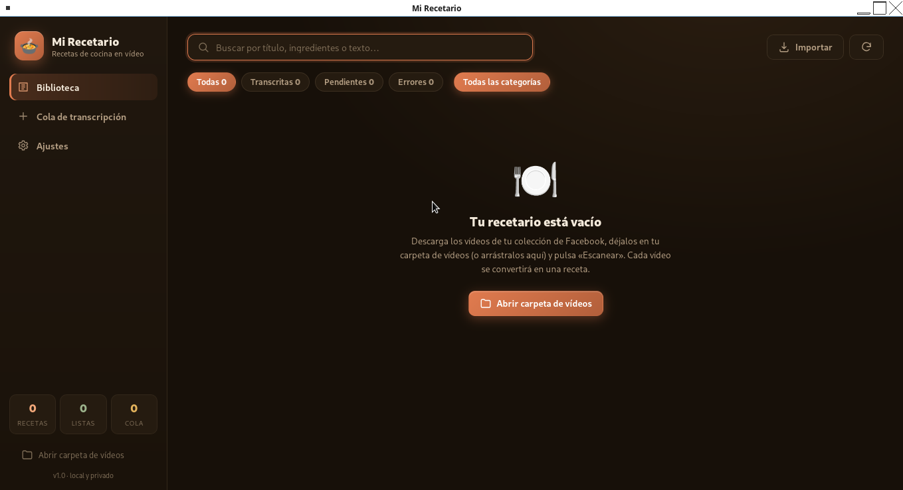

# 🍲 Mi Recetario — recetas de cocina en vídeo

Un programa de escritorio para tu colección de **vídeos de recetas de Facebook**:

1. **Organiza** los vídeos que has guardado en una carpeta de tu equipo.
2. **Transcríbelos a texto** de forma local con Whisper (español incluido) —
   tus vídeos **nunca salen de tu ordenador**.
3. **Edítalos como recetas**: ingredientes, pasos, categorías, etiquetas,
   búsqueda y exportación a Markdown.

> 🐣 **Este README está escrito para principiantes totales.** Si nunca has
> usado la terminal, `pip` o `venv`, no pasa nada: sigue los pasos en orden
> y todo funcionará. Las palabras raras están explicadas.

---

## 1. Cómo conseguir los vídeos de Facebook

Mi Recetario incluye un **importador de Facebook** integrado: captura los
vídeos de tus *colecciones guardadas* y los descarga con un clic, sin
necesidad de herramientas externas.

### 📥 El flujo recomendado: la pestaña «Facebook»

1. Abre Mi Recetario y pulsa **Facebook → Abrir Facebook**. Se abre una
   **ventana nueva** con Facebook y Mi Recetario se queda abierto en la suya.
2. Inicia sesión en Facebook como siempre, con tu verificación en dos pasos si
   la tienes. **Solo la primera vez**: la sesión se recuerda entre ejecuciones
   (la app guarda las cookies en `data/webview/`).
3. Entra a una colección de tus guardados. Abajo a la derecha verás un panel
   con tres botones:
   - **«⬇️ Descargar toda la colección»** — recorre toda la colección
     automáticamente (Facebook va cargando más vídeos al llegar abajo),
     recopila todos los vídeos y arranca la descarga con `yt-dlp`.
   - **«📥 Enviar vídeos visibles»** — envía solo los vídeos que se ven en
     pantalla.
   - **«↩ Cerrar Facebook»** — cierra la ventana de Facebook; Mi Recetario
     sigue abierto.
4. Verás un aviso verde al empezar la descarga. Su **progreso se ve en vivo**
   en la ventana de Mi Recetario: la pestaña **Facebook** muestra la lista por
   vídeo con su barra de porcentaje, y mientras se descarga aparece también un
   **indicador inferior** visible desde cualquier pestaña (pulsarlo te lleva a
   la lista). Al terminar, los vídeos quedan en tu carpeta y aparecen en la
   **Biblioteca**.

Para que la descarga funcione, instala `yt-dlp` (solo hace falta una vez):

```bash
sudo apt install yt-dlp
```

> 🔑 **Colecciones privadas**: tus listas guardadas son privadas, pero el botón
> las lee igualmente porque corre dentro de tu sesión iniciada. Para
> **descargar** esos vídeos, al capturar la app exporta las cookies de tu
> sesión a `data/cookies/fb_cookies.txt` y se las pasa a `yt-dlp`, que así
> descarga con tu sesión (no con el navegador). Si caducan, vuelve a abrir
> Facebook desde la app y captura de nuevo: se refrescan solas.

> 🔒 **HTTPS local**: la app se sirve por HTTPS con un certificado autofirmado
> (se genera solo con `openssl` en `data/cert/`). Es necesario porque Facebook
> es HTTPS y WebKitGTK bloquea los envíos desde una página segura hacia
> `http://127.0.0.1` (contenido mixto). Todo sigue siendo local: el servidor
> solo escucha en 127.0.0.1.

> 📡 **Cómo se envían los vídeos a la app**: Facebook impone una política de
> seguridad (CSP) que prohíbe a cualquier página suya hacer *fetch* hacia
> `127.0.0.1`. Por eso el botón flotante **no usa HTTP**: envía los vídeos por
> el **canal nativo de WebKit** (el puente interno de pywebview), que llega
> directo a la app sin pasar por la red. Ni el CSP, ni CORS ni el contenido
> mixto pueden bloquearlo.

### 🖱️ Alternativa manual (sin usar la pestaña Facebook)

Si prefieres el método 100 % manual, también puedes:

1. En Facebook, abre el vídeo y pulsa **clic derecho → «Guardar vídeo como…»**
   (o usa un descargador individual como `yt-dlp` pegando la URL).
2. Deja los archivos en la carpeta de vídeos de la app (por defecto
   `~/Videos/Recetas`).
3. Abre Mi Recetario, pulsa **Escanear** y el vídeo aparece en la Biblioteca.

En ese caso, la pestaña Facebook te ofrece también un *bookmarklet* para
arrastrar a la barra de marcadores de tu navegador y capturar desde allí.

> ⚠️ El importador navega Facebook con tu cuenta (igual que harías tú a mano)
> y solo recoge los vídeos que **tú** ves en pantalla; no rastrea tu perfil ni
> el de nadie. Como con cualquier automatización, conviene usarlo con
> moderación para no llamar la atención sobre tu cuenta.

---

## 2. Qué necesitas antes de empezar

- **Python 3.10 o superior** (casi cualquier Linux moderno lo trae).
- Una **terminal** (la ventanita donde se escriben comandos).
- **Conexión a internet** la primera vez (para descargar el motor de
  transcripción y el modelo de idioma).

Para comprobar si tienes Python, abre una terminal y escribe:

```bash
python3 --version
```

Si ves algo como `Python 3.11.x` o superior, estás listo. Si te da error o te
dice que falta `venv`, mira la sección [9. Solución de problemas](#9-solución-de-problemas).

---

## 3. ¿Qué es eso de `venv` y `pip`? (explicado sin tecnicismos)

Piensa en un programa de Python como una receta de cocina: necesita varios
"ingredientes" (paquetes) para funcionar: Flask, Pillow, el motor de
transcripción, etc.

- **`pip`** es la herramienta que descarga e instala esos ingredientes.
- **`venv`** (entorno virtual) es una **caja aislada** dentro de tu proyecto
  donde se guardan esos ingredientes, sin tocar el resto del sistema.

¿Por qué hace falta esta caja? Porque casi todos los ingredientes de Mi
Recetario existen como paquetes de tu distribución de Linux... **excepto uno**:
el motor de transcripción (`faster-whisper`). Ese solo se consigue con `pip`,
y lo correcto es instalarlo dentro de su caja (`venv`), no en el sistema.
Así no rompes nada, y si algo falla, borras la caja y la creas de nuevo.

> La carpeta del entorno virtual se llama `venv/` y vive dentro de la carpeta
> del proyecto. Se puede borrar y recrear cuando quieras: los datos de tus
> recetas están en otra carpeta (`data/`) y no se pierden.

---

## 4. Instalación paso a paso

Abre una terminal y copia los comandos **uno a uno**, pulsando Enter después
de cada uno.

**Paso 1 — Ve a la carpeta del proyecto.** (Cambia la ruta por la tuya si
instalaste el proyecto en otro sitio.)

```bash
cd ~/Dev3/recipe_book_downloader
```

**Paso 2 — Crea el entorno virtual (la "caja").** Esto solo se hace **una
vez**, en la primera instalación.

```bash
python3 -m venv venv
```

No verás ningún mensaje si todo ha ido bien. Eso es normal.

**Paso 3 — Activa el entorno virtual.** Fíjate en el `(venv)` que aparece
al principio de la línea: es la señal de que estás dentro de la caja.

```bash
source venv/bin/activate
```

**Paso 4 — Instala los ingredientes.** Esto descarga e instala todo lo que
el programa necesita (puede tardar unos minutos la primera vez).

```bash
pip install -r requirements.txt
```

**Paso 5 — Arranca el programa.**

```bash
python run.py
```

Se abrirá la ventana de **Mi Recetario**. 🎉

---

## 5. Activar y desactivar el entorno virtual

El entorno virtual se **activa** cuando quieres usar `pip` o `python` dentro
de él, y se **desactiva** cuando terminas.

### 🔓 Activar

```bash
source venv/bin/activate
```

Verás `(venv)` al principio de la línea del terminal:

```
(venv) usuario@equipo:~/Dev3/recipe_book_downloader$
```

Mientras esté ese `(venv)`, los comandos `python` y `pip` usan el entorno
del proyecto. Cuando lo cierres (cerrando la ventana), se desactiva solo.

### 🔒 Desactivar

```bash
deactivate
```

El `(venv)` desaparece de la línea y vuelves al sistema normal. (Si no lo
has activado antes, no hay nada que desactivar.)

### 🤓 Truco: no hace falta activar para usar la app

Para **lanzar el programa** no necesitas activar nada. Este comando funciona
siempre, estés donde estés (dentro de la carpeta del proyecto):

```bash
venv/bin/python run.py
```

Es la misma app, sin pasos extra. Mucha gente lo usa directamente.

---

## 6. Cómo usar el programa

### Opción A — ventana nativa de escritorio (recomendada)

```bash
venv/bin/python run.py
```



### Opción B — en el navegador

```bash
venv/bin/python run.py --web
```

### Opción C — solo el servidor interno (para pruebas / API)

```bash
venv/bin/python run.py --serve --port 8765
```

**Sobre la primera transcripción:** la primera vez que pulses *Transcribir*,
el programa descarga el modelo de idioma (unos 460 MB el modelo *small* por
defecto, que se guarda en `~/.cache/huggingface`). Solo ocurre una vez.
Si tu ordenador es modesto, puedes elegir el modelo *tiny* o *base* en
**Ajustes** para que sea más rápido (a cambio de algo de precisión).

---

## 7. Funciones

- **Biblioteca**: tarjetas con miniatura, búsqueda por título/texto y
  filtros por categoría y estado.
- **Editor de receta**: reproductor de vídeo, transcripción editable en vivo,
  listas de ingredientes y pasos, etiquetas, notas y exportación `.md`.
- **Cola de transcripción**: progreso en tiempo real, cancelación y reintento.
- **Ajustes**: carpeta de vídeos, modelo de Whisper, idioma, hilos de CPU y VAD.
- **Importar**: arrastra vídeos a la ventana para copiarlos a tu carpeta.
- **Facebook**: se abre en una **ventana propia** (Mi Recetario sigue abierto),
  captura tus vídeos guardados con tu propia sesión y los descarga con
  `yt-dlp` a tu carpeta, con el **progreso en vivo** desde cualquier pestaña.

---

## 8. Cómo actualizar el programa

Cuando haya una versión nueva:

```bash
cd ~/Dev3/recipe_book_downloader
git pull
source venv/bin/activate
pip install -r requirements.txt
```

(El `git pull` descarga el código nuevo y el `pip install` actualiza los
ingredientes si hace falta.)

---

## 9. Solución de problemas

|  Problema | Solución |
|--- |---|
| `python3: command not found`  | Instala Python: `sudo apt install python3` |
| `ensurepip is not available` o falta `venv` | Instala el módulo: `sudo apt install python3-venv` y repite el Paso 2 |
| `error: externally-managed-environment` | Es normal en Debian/MX: significa que pip no debe tocar el sistema. **Activa el venv** (Paso 3) y repite el Paso 4 |
| El venv está "roto" o algo raro ocurre | Bórralo y créalo de nuevo: `rm -rf venv` y repite los pasos 2 a 4. Tus recetas no se pierden (están en `data/`) |
| La transcripción tarda mucho | Elige un modelo más pequeño en **Ajustes** (tiny o base) |
| La descarga del modelo falla a mitad | Vuelve a intentarlo: reanuda donde se quedó. Si falla siempre, revisa tu conexión o proxy |
| Los vídeos privados de Facebook no se descargan (error de autenticación) | Las cookies caducaron. Abre Facebook desde la app y captura de nuevo: la app las refresca automáticamente |
| No veo el progreso de la descarga | Mientras se descarga, hay un indicador inferior en cualquier pestaña; la lista completa por vídeo está en la pestaña Facebook |

---

## 10. Estructura del proyecto

```
app/            Backend (Flask, SQLite, Whisper, escáner de vídeos)
web/            Interfaz (HTML/CSS/JS, sin frameworks externos)
data/           Base de datos, miniaturas y ajustes (se crea al primer uso)
venv/           Entorno virtual (NO se toca a mano; se crea con el Paso 2)
run.py          Punto de entrada
```

Todo es **local y privado**: base de datos SQLite y transcripción en tu CPU,
sin enviar nada a internet (excepto la descarga inicial del modelo de idioma).

---

## 11. Tecnologías por dentro (para estudiantes de informática)

Esta sección explica **qué hay detrás de cada parte** del programa. Si ya
programas o estás estudiando, aquí tienes el mapa: qué tecnología hace cada
cosa, por qué se eligió y dónde está en el código.

> **La idea arquitectónica en una frase:** Mi Recetario es una aplicación
> *cliente-servidor local*. Un proceso Python levanta un servidor web que solo
> escucha en `127.0.0.1`, y la interfaz es una página web (HTML/CSS/JS) que ese
> mismo servidor sirve. La "ventana nativa" del escritorio es, en realidad, un
> **navegador embebido** apuntando a esa URL local. Nada de esto necesita
> internet para funcionar.

### 11.1 Backend: Python 3.10+ y Flask

- **Flask** es un micro-framework HTTP de Python. Aquí define una **API REST**
  que devuelve JSON: `GET /api/recipes`, `POST /api/recipes/<id>/transcribe`,
  `POST /api/settings`… Cada ruta es una función Python decorada con
  `@app.get(...)` / `@app.post(...)` (ver `app/server.py`).
- **Werkzeug** (la base de Flask) sirve la app con `make_server(threaded=True)`:
  un **servidor WSGI multihilo** donde cada petición HTTP se atiende en un hilo
  propio (`run.py`).
- El mismo servidor sirve el **frontend estático** (`web/`) y los **vídeos**
  (`/media/video/<id>`) con soporte de **peticiones HTTP Range** (respuestas
  `206 Partial Content`): es lo que permite hacer *seek* en el reproductor de
  vídeo sin descargar el archivo entero.
- El middleware `after_request` controla **CORS** solo en `/api/fb/*`,
  aceptando únicamente orígenes de Facebook o de la propia app (ver 11.8).

### 11.2 Persistencia: SQLite (sin servidor, sin ORM)

- **SQLite** es una base de datos **embebida**: no hay un proceso de base de
  datos aparte, todo vive en un archivo (`data/recipes.db`). Perfecta para una
  app local de un solo usuario.
- Se usa el módulo estándar `sqlite3`, con `check_same_thread=False` porque
  varios hilos acceden a la misma conexión, y un `threading.Lock` protege cada
  operación de escritura (`app/database.py`).
- Las listas (`tags`, `ingredients`, `steps`) se guardan como **texto JSON**
  y se serializan/deserializan con `json.dumps` / `json.loads`.
- La búsqueda sin distinguir tildes se hace **normalizando el texto a Unicode
  NFD** y eliminando los caracteres de acentuación antes de comparar.
- Hay índices sobre `status` y `category` para que los filtros de la biblioteca
  sean rápidos aunque haya miles de recetas.

### 11.3 Transcripción local: Whisper (faster-whisper)

- **Whisper** es un modelo de aprendizaje automático de OpenAI para
  **transcribir audio a texto** (publicado en el artículo *"Robust Speech
  Recognition via Large-Scale Weak Supervision"*). Es un **transformer
  encoder-decoder** entrenado con cientos de miles de horas de audio con
  subtítulos, y soporta ~99 idiomas.
- **faster-whisper** es una reimplementación sobre **CTranslate2** (motor de
  inferencia optimizado para CPU/GPU). Aquí se usa con `compute_type="int8"`
  (**cuantización a enteros de 8 bits**: ~4× más rápido y con menos memoria que
  float32, a costa de una pérdida de precisión mínima) y `cpu_threads` para
  paralelizar dentro del equipo (`app/transcription.py`).
- Antes de transcribir, un **VAD** (Voice Activity Detection, de Silero)
  descarta silencios y música de fondo: en vídeos de cocina eso evita
  alucinaciones de texto en las partes sin voz.
- La decodificación usa **beam search**; el modelo devuelve *segmentos* con su
  timestamp, que la app va volcando a la base de datos en tiempo real.
- Los tamaños `tiny`/`base`/`small`/`medium` son modelos del mismo Whisper con
  distinto número de parámetros: más grande = más preciso, pero más lento y
  más memoria (el `small` por defecto ocupa ~460 MB y se descarga de
  **Hugging Face** la primera vez, a `~/.cache/huggingface`).

### 11.4 La ventana nativa: pywebview y WebKitGTK

- **pywebview** crea ventanas de escritorio con un motor web real dentro
  (**WebKitGTK** en Linux, WebView2/WebKit en otros sistemas). Permite
  combinar una interfaz web con APIs de Python.
- Su **puente nativo** (`js_api`, el canal `jsBridge`) permite que el
  JavaScript de una página llame a métodos de Python **sin pasar por HTTP**.
  Es la pieza clave del importador de Facebook: el CSP de Facebook bloquea el
  `fetch` hacia `127.0.0.1`, pero no puede bloquear este canal interno
  (`app/window.py` y el script de captura en `app/fb.py`).
- La inyección del botón flotante usa **user scripts de WebKit**: scripts que
  se registran para ejecutarse en `document-start` de *cada* página que carga
  la ventana, con un guard que solo actúa en `facebook.com`.
- Con `private_mode=False` y `storage_path` la sesión (cookies) sobrevive al
  cierre de la app; se guarda en `data/webview/`.
- Detalle de concurrencia curioso: WebKitGTK **solo es seguro desde el hilo
  principal**, así que las operaciones que vienen de hilos Python se programan
  con `GLib.idle_add` (ver `_navigate_later` en `app/window.py`).

### 11.5 Descarga de vídeos: yt-dlp

- **yt-dlp** (fork activo de youtube-dl) es una **CLI escrita en Python** capaz
  de descargar vídeos de cientos de sitios, incluido Facebook.
- La app lo lanza como **subproceso** (`subprocess.Popen`) y lee su salida en
  vivo para mostrar el progreso: cada línea `[download] N%` se parsea con una
  expresión regular y se guarda en la cola de descargas (`app/fb.py`).
- Para las **colecciones privadas**, exporta las cookies de la sesión del
  webview a un archivo en **formato Netscape** y se las pasa a `yt-dlp` con
  `--cookies` (es el formato que esa herramienta espera).
- La cancelación la aplica un **hilo vigilante** que llama a `proc.terminate()`
  si el usuario pulsa Detener (necesario porque la salida de yt-dlp puede ir
  almacenada en búfer y no llegar al bucle de lectura).

### 11.6 Metadatos y miniaturas: PyAV, ffmpeg y Pillow

- **PyAV** (bindings de Python para las librerías de **FFmpeg**) abre el vídeo
  para leer su **duración** y extraer el **primer fotograma**.
- **Pillow** redimensiona ese fotograma y lo guarda como JPEG (la miniatura de
  la tarjeta de la receta).
- Si PyAV no está disponible, hay *fallback* a los binarios del sistema
  `ffprobe` y `ffmpeg` (`app/scanner.py`).

### 11.7 Frontend: HTML, CSS y JavaScript (sin frameworks)

- No hay React ni Vue: la interfaz es **JS vanilla** ("use strict"). El DOM se
  construye con *template literals*, se escapan los valores con `esc()` para
  evitar inyección de HTML, y las llamadas a la API usan **fetch** con JSON.
- El "tiempo real" se consigue por **polling**: un `setInterval` consulta el
  estado cada 1,5 s (`/api/transcription/jobs`, estado de descargas, …) y
  redibuja lo que cambió. Es la solución sencilla; para este volumen de datos
  no hace falta WebSocket ni SSE.
- El reproductor es la etiqueta HTML `<video>` alimentada por el endpoint
  `/media/video/<id>` con soporte Range (ver 11.1).

### 11.8 Concurrencia y seguridad web, aplicadas de verdad

Este proyecto es un buen caso de estudio porque junta varios conceptos que en
clase parecen teoría:

- **Contenido mixto (mixed content):** una página HTTPS no puede hacer
  peticiones a `http://127.0.0.1`. Como Facebook es HTTPS, la app se sirve a sí
  misma por **HTTPS local con certificado autofirmado** (generado con
  `openssl` en `data/cert/`). Un certificado autofirmado es válido para
  localhost, pero los navegadores lo rechazarían en cualquier otro sitio.
- **CSP (Content-Security-Policy):** Facebook prohíbe a sus páginas hacer
  `fetch` hacia direcciones locales. Por eso el botón flotante envía los vídeos
  por el **canal nativo de pywebview** (jsBridge), que no es una petición HTTP
  y no le aplica el CSP.
- **CORS, CSRF y DNS-rebinding:** el servidor local acepta peticiones de
  Facebook o de la propia app, y rechaza cualquier otro origen (`Origin`). Así,
  una página web maliciosa no puede hacer que tu servidor local descargue
  vídeos sin tu permiso.
- **El servidor solo escucha en `127.0.0.1`**: no hay puertos abiertos a la
  red. De tu equipo solo salen la descarga inicial del modelo (Hugging Face) y
  las descargas de vídeos de yt-dlp.

### 11.9 Dónde se guardan los archivos descargados (mapa de rutas)

Una duda muy típica: "¿y esto dónde se ha descargado?". Aquí tienes el mapa
completo. Distingue dos sitios: **dentro del proyecto** (carpeta `data/`, que
se crea al primer uso) y **fuera, en tu carpeta de usuario** (cachés y vídeos).

| Ruta | Qué contiene | ¿Cómo llega ahí? |
|---|---|---|
| `data/recipes.db` | Base de datos SQLite: recetas, transcripciones, estado | La crea y la escribe la app |
| `data/thumbs/` | Miniaturas JPEG de cada vídeo (`thumb_<id>.jpg`) | Las genera la app con PyAV/Pillow |
| `data/settings.json` | Ajustes: carpeta de vídeos, modelo, idioma, hilos, VAD | Los guardas tú desde **Ajustes** |
| `data/webview/` | Perfil del navegador embebido: cookies y sesión de Facebook | Lo persiste pywebview (`private_mode=False`); si lo borras, tendrás que iniciar sesión otra vez |
| `data/cookies/fb_cookies.txt` | Cookies de tu sesión de Facebook en formato Netscape, para `yt-dlp` | Se exportan desde el webview en cada captura (colecciones privadas) |
| `data/cert/` | Certificado HTTPS autofirmado (`cert.pem`, `key.pem`) | Lo genera `openssl` la primera vez (`run.py`) |
| `venv/` | Todos los paquetes de Python instalados con pip (Flask, faster-whisper, pywebview…) | Se crea con `python3 -m venv venv` y `pip install -r requirements.txt` |
| `venv/lib/python3.*/site-packages/faster_whisper/assets/silero_vad.onnx` | Modelo **VAD de Silero** (detección de voz) | Viene **incluido en el paquete pip** de faster-whisper; no se descarga aparte |
| `~/.cache/huggingface/hub/models--Systran--faster-whisper-small/` | Modelo de Whisper **small** (~460 MB) | Se descarga de **Hugging Face** la primera vez que transcribes. El nombre cambia con el modelo elegido (`...faster-whisper-tiny/`, `...-base/`, `...-medium/`) |
| `~/Videos/Recetas` | **Los vídeos descargados** de Facebook con yt-dlp | Carpeta vigilada; se puede cambiar en **Ajustes**. Ahí es donde la app busca vídeos nuevos |

**Qué se puede borrar sin miedo y qué no:**

- `data/` es **tu información** (recetas, transcripciones, sesión de Facebook):
  no se toca si reinstalas. Es lo único que conviene **respaldar**.
- `venv/` se puede borrar y recrear cuando quieras (pasos 2-4 de la
  instalación): los datos no están ahí. Lo mismo vale para `data/cert/` (se
  regenera solo) y `data/cookies/` (se refresca en la siguiente captura).
- `~/.cache/huggingface/` es solo caché: si la borras, el modelo de Whisper se
  **vuelve a descargar** en la próxima transcripción (~460 MB, solo una vez).
- Los vídeos de `~/Videos/Recetas` son **tus archivos**: borrarlos desde la app
  (botón de eliminar) o a mano los quita del disco; la base de datos guarda la
  referencia, por eso la app detecta si un vídeo "ya no existe".

### 11.10 Para profundizar

Si quieres estudiar el código, este es el orden recomendado:

```
run.py                  → cómo arranca todo (servidor, HTTPS, ventana)
app/server.py           → la API REST y el servidor de medios
app/database.py         → capa de persistencia (SQLite + hilos)
app/transcription.py    → Whisper: modelo, VAD, cola y cancelación
app/window.py           → pywebview: puente nativo y user scripts
app/fb.py               → yt-dlp, cookies Netscape y script de captura
web/app.js              → frontend: fetch, polling y render del DOM
```

Documentación oficial de las piezas clave: [Flask](https://flask.palletsprojects.com/),
[SQLite](https://www.sqlite.org/docs.html), [faster-whisper](https://github.com/SYSTRAN/faster-whisper),
[pywebview](https://pywebview.flowrl.com/), [yt-dlp](https://github.com/yt-dlp/yt-dlp),
y el artículo de [Whisper](https://cdn.openai.com/papers/whisper.pdf).
